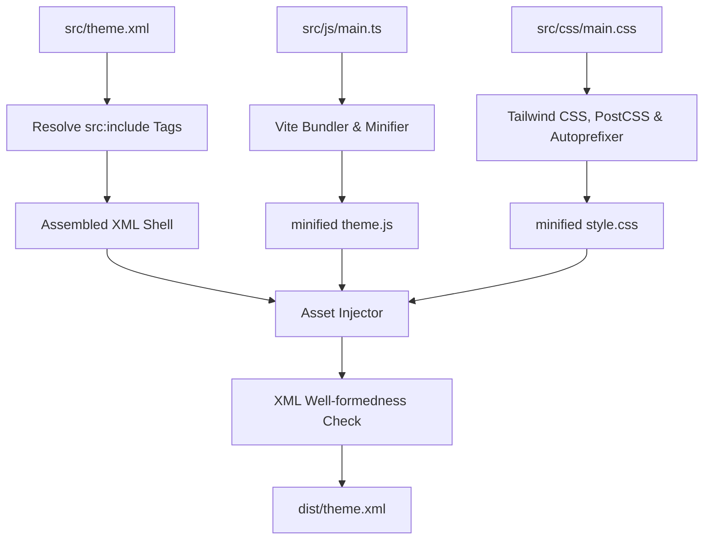

# Project Architecture: Blogger Theme Framework (ARCHITECTURE.md)

This document details the modular layout design and compilation pipeline of the Blogger Theme Framework.

## 1. System Design Overview

Standard Blogger development requires editing a giant, monolithic XML file. This framework resolves that by treating Blogger XML as a compilation target, allowing developers to work in a modular, component-based workspace.

## 2. Layout Architecture (Single Column Flow)

The theme layout has been structured into a streamlined, single-column vertical stack (without a sidebar):

1. **Header**: Site header with navigation menu, search bar, and logo.
2. **Announcement Box**: Custom HTML announcement section.
3. **Popular Series**: PopularPosts widget rendered as a horizontal responsive grid.
4. **Latest Updates**: The main posts stream.
5. **Footer**: Brand disclaimer, quick links, and social followings.

## 3. Directory Structure Blueprint
- **`src/theme.xml`**: Root template file containing asset injection placeholders.
- **`src/components/`**:
  - `component-header.xml`: Nav header drawer, menu, and search.
  - `component-announcement.xml`: Full-width announcement box section.
  - `component-bookmarks.xml`: Bookmarks shelf drawer and container.
  - `component-footer.xml`: Footer links and copyright.
- **`src/sections/`**:
  - `section-main.xml`: Main listing and post view sections.
  - `section-popular-series.xml`: Popular Posts grid widget.
- **`src/includes/`**:
  - `seo-meta.xml`: Schema and header SEO metadata.
  - `fonts-icons.xml`: Preconnect URLs for Google Fonts.
  - `series-card.xml`: Reusable card layout includable.
  - `series-post.xml`: Reusable post/chapter detail layout includable.
  - `pagination.xml`: Next and previous post buttons.
  - `comment-picker.xml`: Wrapper for native comments.
- **`src/css/main.css`**: Tailwind base and class stylesheets (renamed to `.series-` class structure).
- **`src/js/main.ts`**: TypeScript controllers, updating localStorage bookmarks keys to `series_bookmarks`.
